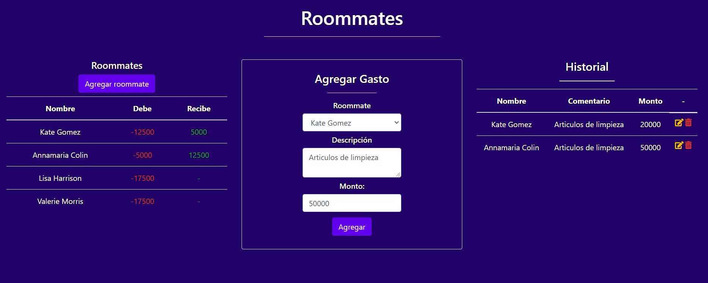

# Desafio Evaluado - Roommates

## Habilidades a evaluar

-  Manipular archivos con File system
-  Manejar errores
-  Construir una API RESTful
-  Manejar códigos de estado HTTP
-  Utilizar paquetes de npm

## Descripción

Es bien sabido que entre las mejores recomendaciones que un programador amateur puede recibir para mejorar sus habilidades es “crear aplicaciones”, sin darle tanta importancia a la temática a elaborar, sino que solo basta con un problema para desarrollar una solución digital.

En esta prueba deberás crear un servidor con Node que sirva una interfaz HTML que tendrás a disposición en el **Apoyo Prueba - Roommates** y cuya temática está basada en el registro de gastos entre roommates.

Además deberás servir una API REST que permita hacer lo siguiente:

-  Almacenar roommates nuevos ocupando [random user](https://randomuser.me/api).
-  Devolver todos los roommates almacenados.
-  Registrar nuevos gastos.
-  Devolver el historial de gastos registrados.
-  Eliminar gastos del historial.

A continuación se muestra una imagen con la interfaz que deberás devolver en la ruta raíz
del servidor:

Rutas que debes crear en tu servidor:

-  **/GET**: Debe devolver el documento HTML disponible en el apoyo.
-  **/roommate POST**: Almacena un nuevo roommate ocupando [random user](https://randomuser.me/api).
-  **/roommate GET**: Devuelve todos los roommates almacenados.
-  **/gastos GET**: Devuelve el historial con todos los gastos registrados.
-  **/gasto PUT**: Edita los datos de un gasto.
-  **/gasto DELETE**: Elimina un gasto del historial.

## Requerimientos

1. Ocupar el módulo File System para la manipulación de archivos alojados en el servidor.

2. Capturar los errores para condicionar el código a través del manejo de excepciones.

3. El botón “Agregar roommate” de la aplicación cliente genera una petición POST (sin payload) esperando que el servidor registre un nuevo roommate random con la API randomuser, por lo que debes preparar una ruta **POST /roommate** en el servidor que ejecute una función asíncrona importada de un archivo externo al del servidor (la función debe ser un módulo), para obtener la data de un nuevo usuario y la acumule en un JSON (roommates.json).

   El objeto correspondiente al usuario que se almacenará debe tener un id generado con el paquete UUID.

4. Crear una API REST que contenga las siguientes rutas:
   <ol type="a">
      <li><strong>GET /gastos</strong>: Devuelve todos los gastos almacenados en el archivo gastos.json.</li>
      <li><strong>POST /gasto</strong>: Recibe el payload con los datos del gasto y los almacena en un archivo JSON (gastos.json).</li>
      <li><strong>PUT /gasto</strong>: Recibe el payload de la consulta y modifica los datos almacenados en el servidor (gastos.json).</li>
      <li><strong>DELETE /gasto</strong>: Recibe el id del gasto usando las Query Strings y la elimine del historial de gastos (gastos.json).</li>
      <li><strong>GET /roommates</strong>: Devuelve todos los roommates almacenados en el servidor (roommates.json)</li>
   </ol>
   Se debe considerar recalcular y actualizar las cuentas de los roommates luego de este proceso.

5. Devolver los códigos de estado HTTP correspondientes a cada situación.

6. Enviar un correo electrónico a todos los roommates cuando se registre un nuevo gasto. Se recomienda agregar a la lista de correos su correo personal para verificar esta funcionalidad. **(Opcional)**

## Notas

### Dónde encontrar cada requerimiento

1. `models/model.js` Cada método de la clase utiliza fs-extra para leer/escribir .json en `/db`. [Ejemplo](https://github.com/Aframuz/roomates/blob/e665818c2d3e095444d268ab24af1515022889d4/models/model.js#L35)

2. `controllers/` `models/` `middleware/` `public/js`. Básicamente cada vez que se ocupa una `async function`. [Ejemplo](https://github.com/Aframuz/roomates/blob/e665818c2d3e095444d268ab24af1515022889d4/models/model.js#L42)

3. `routes/roommate-route.js` ejecuta la función asíncrona en `middleware/get-rnd-user.js` para obtener un usuario de la random user API y luego `controllers/roommate-controller.js` para guardarlo en la base de datos. [Función que genera usuario](https://github.com/Aframuz/roomates/blob/e665818c2d3e095444d268ab24af1515022889d4/middleware/get-rnd-user.js#L12), [Función que guarda usuario en base de datos](https://github.com/Aframuz/roomates/blob/e665818c2d3e095444d268ab24af1515022889d4/controllers/roommate-controller.js#L24).

4. Todas las rutas están en `routes/`. En específico:

   -  [GET gastos](https://github.com/Aframuz/roomates/blob/e665818c2d3e095444d268ab24af1515022889d4/controllers/gasto-controller.js#L14)
   -  [POST gastos](https://github.com/Aframuz/roomates/blob/e665818c2d3e095444d268ab24af1515022889d4/controllers/gasto-controller.js#L27)
   -  [PUT gastos](https://github.com/Aframuz/roomates/blob/e665818c2d3e095444d268ab24af1515022889d4/controllers/gasto-controller.js#L52)
   -  [DELETE gastos](https://github.com/Aframuz/roomates/blob/e665818c2d3e095444d268ab24af1515022889d4/controllers/gasto-controller.js#L69)
   -  [GET roommates](https://github.com/Aframuz/roomates/blob/e665818c2d3e095444d268ab24af1515022889d4/controllers/roommate-controller.js#L11)

   El cálculo de los gastos se encuentra en una [función aparte](https://github.com/Aframuz/roomates/blob/e665818c2d3e095444d268ab24af1515022889d4/middleware/calculate-debt.js#L5)

5. Todas las funciones dentro de `controllers/` utilizan el método otorgado por Express `res.status` para indicar el código HTTP correspondiente.

6. `middleware/email-sender.js` contiene un ejemplo de cómo mandar emails a todas las personas en la base de datos. Usé [Mailtrap](https://mailtrap.io) para verificar el envío de emails. La configuración está [acá](https://github.com/Aframuz/roomates/blob/1c9612768c0ed8292cc657d54c5df9a3d06070a0/middleware/email-sender.js#L4).

### Alternativas usadas

-  **pnpm** en vez de npm
-  **nanoid** en vez de UUID
-  **fs-extra** en vez de fs
-  **Nodev18 fecth** en vez de axios o client-side fecth, axios está disponible en middleware

### TODO

-  [ ] cambiar error status boilerplate en controllers
-  [ ] alternativa para importar bootstrap/jQuery/font-awesome
-  [ ] sanitizar inputs
